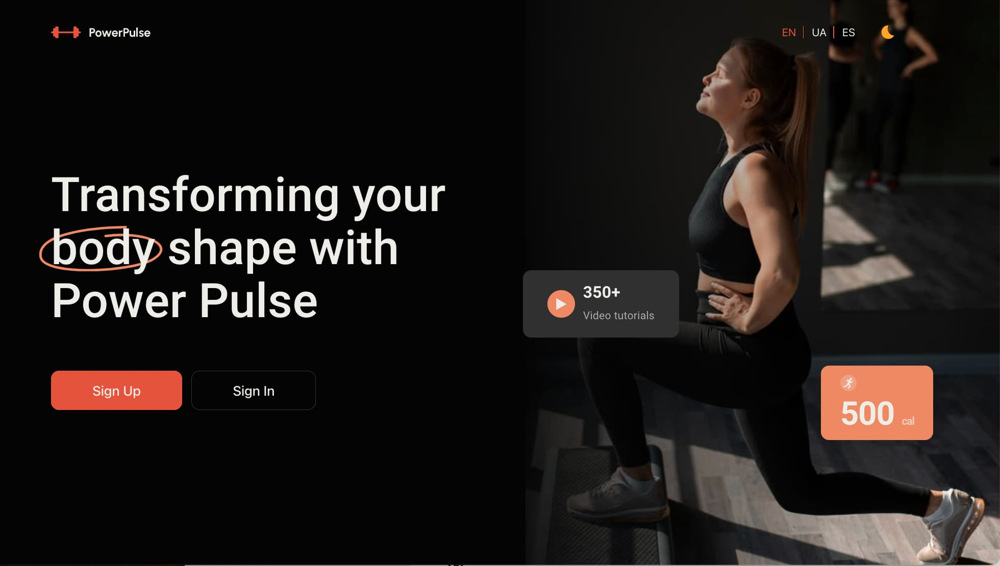

# PowerPulse - React & Node.js app

Discover the groundbreaking PowerPulse app — an innovative solution with
intuitive interface compatible with any device, designed to support your pursuit
of a healthy and energetic lifestyle :runner:

## About the project

This app allows you to explore and manage your sports activity and nutrition.
Users can:

- [x] create accounts
- [x] select different physical activities
- [x] count calories burned
- [x] track time spent in physical activity
- [x] calculate the number of calories consumed with a particular meal
- [x] identify products suitable for their diet based on their blood type
- [x] change language & dark/light theme

## References

Live page:
[**Power Pulse**](https://georgijbudik.github.io/project-GOreITshniki)

Project design:
[**Layout**](https://www.figma.com/file/FHAaMcWwZCDbzWPlowFhEf/Power-Pulse?type=design&mode=design&t=pEbMMrU24sjh3Lm3-0)

## Technologies used:

| `FrontEnd`        | `BackEnd`  | `General`  |
| ----------------- | ---------- | ---------- |
| HTML5/CSS3        | Node.js    | VSCode     |
| JavaScript        | Express    | GIT/GitHub |
| React             | MongoDB    | Figma      |
| Redux Toolkit     | Cloudinary |            |
| Pagination        | Render     |            |
| React Router      | Swagger    |            |
| Axios             |            |            |
| Styled Components |            |            |
| Material-UI       |            |            |

## Installation & Scripts

1. Clone the repository:
   `git clone https://github.com/georgijbudik/project-GOreITshniki`
2. Install the dependencies: `npm install`
3. Run development mode: `npm run dev`
4. Start local server: `npm start`
5. Run production build: `npm build`

## API

Our team also developed the backend this application relies on:
[**Power Pulse BackEnd**](https://github.com/georgijbudik/backend-GOreITshniki)

Endpoint documentation:
[**Power Pulse API**](https://backend-project-dl3a.onrender.com/api-docs/)

# Development team - GOreITshniki :eyes:

[](https://github.com/georgijbudik)
Georgii Budik | **Team Lead** | **Full Stack Developer**

[](https://github.com/NanaTsK)
Nana Tsomaya-Kostova | **Scrum Master** | **Full Stack Developer**

[](https://github.com/Ivan011001)
Ivan Nedokhodiuk | **Full Stack Developer**

[](https://github.com/olenakond)
Olena Kondratchuk | **Full Stack Developer**

[](https://github.com/bajmutov)
Oleksandr Bakhmutov | **Full Stack Developer**

[](https://github.com/AndriiMishch)
Andrii Mishchenko | **Full Stack Developer**

[](https://github.com/AnastasiaBndr)
Anastasiia Bondarchuk | **Full Stack Developer**

[](https://github.com/Slav-0N)
Viacheslav Sosiedko | **Full Stack Developer**

[](https://github.com/Golik07)
Oleksandr Holiakov | **Full Stack Developer**

[](https://github.com/yuliatos12)
Yuliia Yaremenko | **Full Stack Developer**

[](https://github.com/Anatolii2709)
Anatolii Tokariev | **Full Stack Developer**

**A big thank you to our team for their contributions to this project!**
:blue_heart::yellow_heart:

====================================================================================

That is so funny! :joy: That is so funny! :joy:

That is so funny! :sport:

## GoIT Node.js Course Template Homework

### Text

```json
text
```

repo http://github.com

## Tutorial

// ❌

// ✅

## Technologies

- **_General_**

  - 
    
    
  - 
  - 

- **_Front-end_**

  - 
    
  - 
  - 
  - 
  - 

- **_Back-end_**
  - 
  - 
  - 
    
  - 

========================

Here's a sentence with a footnote. [^1]

[^1]: This is the footnote.

### My Great Heading {#custom-id}

term : definition

~~The world is flat.~~

- [x] Write the press release
- [ ] Update the website
- [ ] Contact the media

I need to highlight these ==very important words==.

H~2~O

X^2^

| Syntax    | Description |
| --------- | ----------- |
| Header    | Title       |
| Paragraph | Text        |

---

> blockquote

```
{
  "firstName": "John",
  "lastName": "Smith",
  "age": 25
}
```

## Technologies used:

| `FrontEnd`        | `BackEnd`  | `General`  |
| ----------------- | ---------- | ---------- |
| HTML5/CSS3        | Node.js    | VSCode     |
| JavaScript        | Express    | GIT/GitHub |
| React             | MongoDB    | Figma      |
| Redux Toolkit     | Cloudinary |            |
| Pagination        | Render     |            |
| React Router      | Swagger    |            |
| Axios             |            |            |
| Styled Components |            |            |
| Material-UI       |            |            |

`FrontEnd`

- HTML5/CSS3
- JavaScript
- React
- Redux Toolkit
- Pagination
- React Router
- Axios
- Styled Components
- Material-UI

`BackEnd`

- Node.js
- Express
- MongoDB
- Cloudinary
- Render

`General`

- VSCode
- GIT/GitHub
- Figma
- Adaptive and responsive design

///////// Інструкції з запуску

    Встановіть залежності: npm install.
    Налаштуйте змінні середовища у файлі .env, з прикладу .env.example.
    Запустіть сервер: npm run start.

/////////
